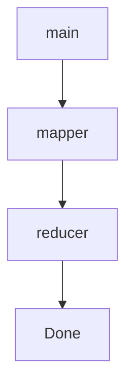

# Go Demo Service

This is a simple Go service that prints "Hello World" via a REST API.

## Prerequisites

- Go (version 1.22 or later)

## Installation

1. Clone this repository:
   ```
   git clone git@github.com:kevbob1/godemo.git
   ```
2. Change to the project directory:
   ```
   cd godemo
   ```

## Usage

Run the service using the following command:

```
go run main.go
```

TODO:
  make vagrantfile arch aware and grab the correct go binary

## Architecture


